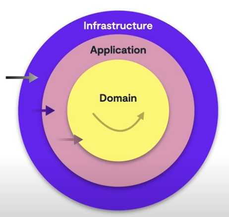

# ProductPrices

## Description
ProductPrices is a Spring Boot application for managing product prices based on brand, product, and application date. It provides RESTful APIs to query and manage product prices.

## Table of Contents
- [Description](#description)
- [Features](#features)
- [Installation](#installation)
- [Running the Application](#running-the-application)
- [Running Tests](#running-tests)
- [Swagger UI Documentation](#swagger-ui-documentation)
- [Technologies Used](#technologies-used)
- [Architecture](#architecture)
- [Contributing](#contributing)
- [License](#license)

## Features
- Manage product prices
- Query prices based on brand, product, and application date
- RESTful API endpoints
- Swagger UI for API documentation

## Installation
1. Clone the repository:

```bash
git clone https://github.com/MVCx9/ProductPrices.git
cd ProductPrices
```

2. Ensure you have Java 21 and Maven installed.

3. Build the project:
```bash
mvn clean install
```

## Running the Application
1. Run the Spring Boot application:
```bash
mvn spring-boot:run
```

2. The application will start on http://localhost:8080.

## Running Tests
### To run all tests:
```bash
mvn test
```

### Run Tests with JaCoCo: 
Execute the following Maven command to run your tests and generate the JaCoCo report.  
```bash
mvn clean test
```
View JaCoCo Report: After running the tests, the JaCoCo report will be generated in the `target/site/jacoco` directory. 

Open the `index.html` file in a web browser to view the detailed coverage report.

open `target/site/jacoco/index.html` in a web browser.


## Swagger UI Documentation
To use Swagger UI and explore API documentation, follow these steps:

1. **Start the Application**:
   Ensure your Spring Boot application is running. You can start it using:
   ```bash
   mvn spring-boot:run
   ```

2. **Open Swagger UI**:
   Open your web browser and navigate to:

   http://localhost:8080/swagger-ui.html

3. **Explore API Documentation**:
    - You will see a list of all available endpoints, grouped by their controllers.
    - Each endpoint will have a description, parameters, and response details.

4. **Try Endpoints**:
    - Click on an endpoint to expand its details.
    - You will see a "Try it out" button. Click it to enable input fields for the endpoint parameters.
    - Fill in the required parameters.
    - Click the "Execute" button to send a request to the endpoint.

5. **View Responses**:
    - After executing the request, you will see the response details, including the status code, response body, and headers.

This allows you to interactively test your API endpoints directly from the Swagger UI interface.

## Technologies Used
- Java 21
- Spring Boot
- Maven
- JPA
- Lombok
- H2 Database
- Swagger UI
- JUnit 5
- Mockito
- JaCoCo

## Architecture
This application follows the principles of Hexagonal Architecture.  

### Benefits of Using Hexagonal Architecture

1. **Separation of Concerns**:
   - Divides the application into core business logic (domain) and external dependencies (adapters).
   - Enhances maintainability and readability by isolating business logic from technical details.

2. **Testability**:
   - Core business logic can be tested independently of external systems.
   - Simplifies unit testing by allowing mock implementations of external dependencies.

3. **Flexibility and Adaptability**:
   - Easily replace or modify external systems (e.g., databases, APIs) without affecting the core business logic.
   - Supports multiple user interfaces or external systems interacting with the same core logic.

4. **Scalability**:
   - Facilitates scaling different parts of the application independently.
   - Adapters can be scaled or optimized without changing the core business logic.

5. **Dependency Inversion**:
   - Core business logic does not depend on external systems, but rather on abstractions (ports).
   - Promotes a more modular and loosely coupled design.

6. **Maintainability**:
   - Clear boundaries between different parts of the application make it easier to understand and modify.
   - Reduces the risk of unintended side effects when making changes.

7. **Reusability**:
   - Core business logic can be reused across different projects or contexts.
   - Adapters can be shared or reused with different core logic implementations.

8. **Technology Agnostic**:
   - Allows the core business logic to remain agnostic of specific technologies or frameworks.
   - Facilitates migration to new technologies with minimal impact on the core logic.

<h1 align="center">
	
</h1>

## Contributing
1. Fork the repository.
2. Create a new branch (`git checkout -b feature-branch`).
3. Make your changes.
4. Commit your changes (`git commit -m 'Add new feature'`).
5. Push to the branch (`git push origin feature-branch`).
6. Open a Pull Request.

## License
This project is licensed under the MIT License. 